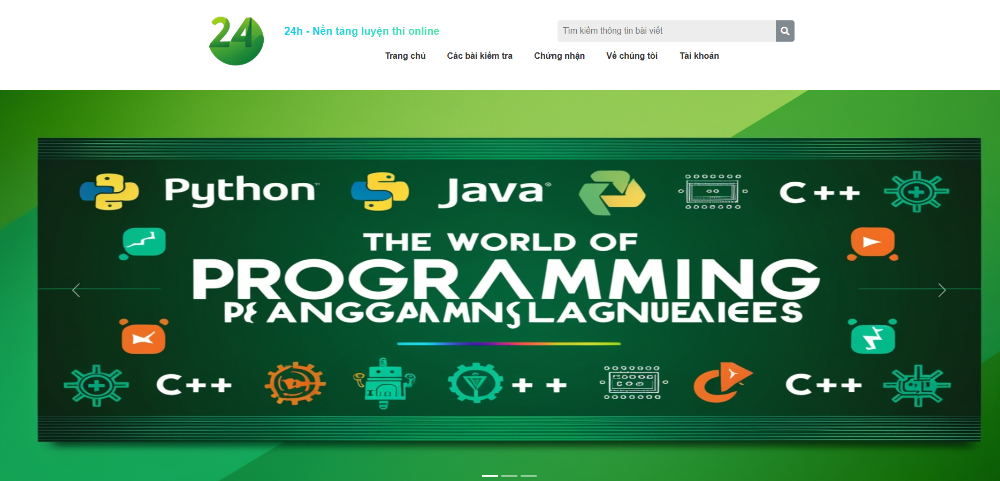
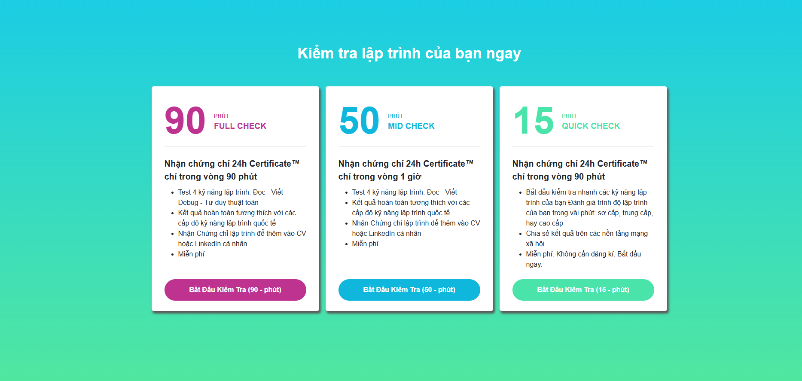

<p align="center">
 <h1 align="center">Programming Languages Quiz Website</h1>
</p>

Welcome to the **Programming Languages Quiz Website** project! 🎉 This web application is designed to help users test their knowledge of various programming languages like **JavaScript, PHP, Python, and more**.

Welcome to the **Programming Languages Quiz Website UI** project! 🎉 This web application consists **only of the user interface**, designed to display multiple-choice quizzes about programming languages like **JavaScript, PHP, Python, and more**.

---
## 🔍 Overview
📝 The website provides an intuitive interface to display quiz lists, questions, and sample feedback.

📌 **Note:** This project is **frontend-only**, meaning it does not include grading or backend logic. Additionally, it is **not yet 100% complete**, and some features are still under development.

<p align="center">
  <br/>
</p>

<p align="center">
  <br/>
</p>

---
## ✨ Key Features
✅ **Quiz List Display**: Easily select quizzes by topic.
✅ **User-Friendly Interface**: Intuitive and easy to navigate.
✅ **Instant Feedback**: Displays sample results (without real logic processing).

---
## ⚙️ How to Use the UI

### 📌 Requirements
- 🌐 A modern web browser (e.g., **Google Chrome, Brave, Firefox**).

### 🚀 Installation
1️⃣ Clone the repository to your local machine:
   ```bash
   git clone https://github.com/NgoDuongwww/web_trac_nghiem.git
   ```
2️⃣ Open the `index.html` file in your browser to view the interface.

---
## 🎮 How It Works
1️⃣ Select a **programming language quiz** from the homepage.
2️⃣ View the list of **multiple-choice questions**.
3️⃣ Submit answers and receive sample feedback (without actual logic processing). 📊

---
## 🛠 Technologies Used
### 🌐 **Frontend**
-  **HTML**
-  **CSS**
-  **JavaScript**

### 🧩 **Framework**
-  **Bootstrap**
-  **AngularJS**

### 🛠 **Development Tools**
-  **Visual Studio Code**
-  **Git**

---
## 🤝 Contributing
We welcome UI contributions! 🚀 If you have ideas or improvements, feel free to **open an issue** or **submit a pull request** to help improve the project.

💡 *Let's build a visually appealing and user-friendly interface together!* ✨
